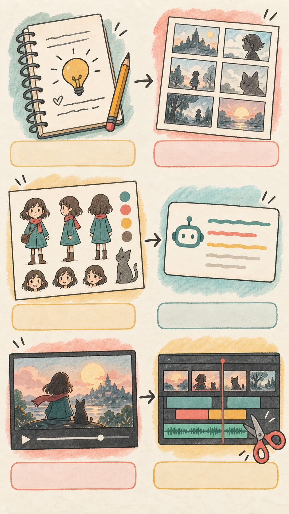
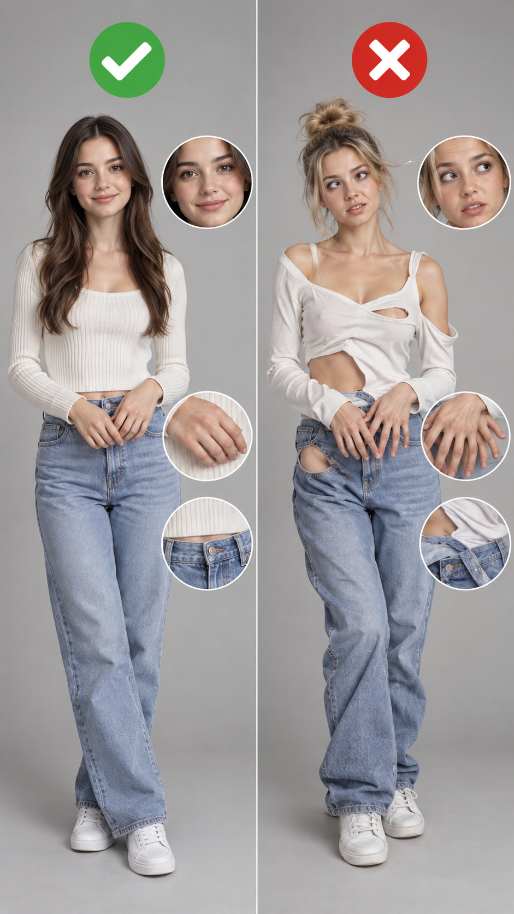

# 做一支 AI 短劇，到底要怎麼開始？— 六步驟完整流程

建立：2026-09-10 Asia/Taipei
來源：AI 短劇製作流程整理
定位：**給第一次做 AI 短劇的新手看的初步教學**，用簡單示意圖說明每一步要做什麼。

---

## 先講三件事，不然你會白花錢

**1. AI 短劇不是「打一句話就跑出一支片」。**
它比較像動畫製作：每一顆鏡頭都要單獨生成、單獨驗收、單獨重做。
一支 30 秒的短劇 ≈ 10–15 顆鏡頭 ≈ 10–15 次生成（順利的話）。

**2. 錢是花在「重抽」上，不是花在「生成」上。**
一次 5 秒 720p 大約 NT$60–65。技術上很便宜。
但新手的失敗率是 3–5 次才過一顆，所以真實成本是 **每秒約 NT$95**。
**流程的目的就是把重抽次數壓下來**，這才是這篇的重點。

**3. 順序不能跳。**
最常見的失敗不是提示詞寫得爛，是**還沒想清楚故事就開始生圖**，
邊生邊想，生到第 8 張才發現前面 7 張接不起來，全部重來。

---

## 全流程總覽

```
① 劇情腳本  →  ② 分鏡  →  ③ 人物角色圖  →  ④ 提示詞  →  ⑤ AI 影片生成  →  ⑥ 剪輯
   （純文字）    （純文字）     （生圖）        （寫字）       （生影片）        （後製）
    免費          免費        很便宜           免費          最貴 ⚠️          免費
```

**成本階梯是這樣的：越前面越便宜，越後面越貴。**
所以每一關都要在便宜的階段就把問題解決掉，不要留到生影片才發現。

## 配圖策略：不要每段都放漂亮成品，要放「會讓人想留言」的證據

這份教學如果要做成 Reels，建議採用「簡短口白＋手繪示意圖／平台截圖」；圖片不是裝飾，而是幫觀眾快速理解每一步。
每張圖只服務一個問題，畫面上加一句短鉤子，讓觀眾自然想回覆。



| 出現位置 | 建議圖片 | 畫面上的短鉤子 | 目的 |
|---|---|---|---|
| 開頭 0–2 秒 | `images/01-六步驟-手繪流程.png` | **「一支 AI 短劇，從哪裡開始？」** | 先建立全貌 |
| 步驟總覽 | `images/01-六步驟-手繪流程.png` | **「先做前面 4 步，才不會一直重抽」** | 讓觀眾看懂順序 |
| ① 劇情腳本 | 手繪流程圖的筆記區 | **「先把故事講清楚」** | 降低入門門檻 |
| ② 分鏡 | 手繪流程圖的分鏡卡區 | **「一張卡，就是一顆鏡頭」** | 展示拆鏡頭概念 |
| ③ 人物角色圖 | `images/02-角色一致性-前後對照.png` | **「角色不固定，後面每顆都會變」** | 讓問題一眼可見 |
| ④ 提示詞 | `images/03-節點工作流示意.png` 的提示詞節點 | **「描述主體、動作、鏡位、限制」** | 示範提示詞結構 |
| ⑤ 影片生成 | `images/libtv-官方首頁.png` | **「把文字、圖片、影片接成工作流」** | 對應 LibTV 畫布 |
| ⑥ 剪輯 | 手繪流程圖的剪輯時間軸區 | **「生成 5 秒，剪成最好看的 2 秒」** | 帶出後製概念 |
| 結尾留言 | `images/02-角色一致性-前後對照.png` | **「你最怕 AI 哪一種變形？」** | 明確引導留言 |




### 畫面編排規則

- 每張示意圖最多停留 1.5–2 秒；失敗對照圖用左右分割，先放錯誤、再放修正版。
- 圖片不要塞滿文字；字幕只留「問題」或「修法」其中一句，其餘靠口白說。
- 失敗案例比完美成品更能留住人：觀眾會想猜「到底哪裡錯」以及分享自己的經驗。
- 若做成輪播圖，以上表格可直接變成 10 張；若做成旁白 Reels，圖片只當畫面證據，不要讓每張圖承擔完整教學。

### 本次配圖素材

- `images/01-六步驟-手繪流程.png`：AI 生成的手繪風總覽圖，可當開場或封面。
- `images/02-角色一致性-前後對照.png`：AI 生成的前後對照示意圖，可當角色圖步驟的視覺例子。
- `images/03-節點工作流示意.png`：AI 生成的節點工作流示意圖，可搭配 LibTV 說明。
- `images/libtv-官方首頁.png`：從 [LibTV 官方網站](https://www.liblib.tv/) 擷取的介面截圖，使用時請在貼文說明標註來源與擷取日期。

---

# ① 劇情腳本

**平台：** ChatGPT／Claude　｜　**這一步做什麼：** 把故事和結尾寫清楚，先不生成圖片。

### 這一步在做什麼
用純文字把故事寫完。**一個字的圖都還不要生。**

### 具體要產出什麼

- **一句話前提**：這集在講什麼。講不清楚就是還沒想好
- **時長**：建議第一支控制在 **30 秒以內**。不是因為短影音法則，是因為成本
- **事件鏈**：A 導致 B、B 導致 C。每個事件一行字
- **笑點／轉折在第幾秒**

初學者可以先寫成 3–5 個事件：主角遇到什麼事 → 做了什麼選擇 → 發生什麼意外 → 最後怎麼收尾。

### ⚠️ 這一步最容易犯的錯

**把物理矛盾留給 AI 解決。** AI 解不了，它只會兩邊都做錯。

例如劇本寫「整杯被撞倒灑出來」，後面又要「喝掉剩下的」，模型就不知道該保留多少。
**修法是回頭改劇本**，明確定義成「杯子傾斜、約一半灑出、杯中保留半杯、杯子不破」。

**規則：任何「等一下再說」的細節，AI 都會幫你亂填。劇本階段就要填完。**

### 順便先做的：合規檢查

如果你的短劇牽涉品牌、食品、健康、身材，**這一關就要過**。
台灣食品廣告查得很嚴，「喝了會瘦」這種因果不能演。
等到影片生完才發現不能發，那是十幾次生成的錢直接丟掉。

---

# ② 分鏡

**平台：** ChatGPT／Claude　｜　**這一步做什麼：** 把故事切成一顆一顆可執行的鏡頭。

### 這一步在做什麼
把腳本切成**一顆一顆鏡頭**，還是純文字。

### 每一顆鏡頭要寫清楚四件事

| 欄位 | 例子 |
|------|------|
| **景別** | 極特寫／特寫／中景／全景 |
| **機位高度** | 貼地／坐姿眼高（約 90 cm）／站立眼高 |
| **焦段感** | 8mm 廣角／35mm／50mm／100mm 微距 |
| **秒數** | 2 秒 |

### ⚠️ 三個新手最容易踩到的鐵則

**鐵則一：一顆鏡頭 = 一個動作。**
不要在同一顆裡面同時要求「角色轉身」＋「物件掉落」＋「鏡頭繞行」。
我們試過，AI 會把兩個相反方向的物理算錯——尾巴往上抖的時候，
本該往下掉的東西跟著往上跑。
拆開來各生一次，反而更省。

**鐵則二：成片每顆最好 2 秒左右，但平台最低生成 4–5 秒。**
所以正確做法是**生 5 秒、剪成 2 秒**，把最好的那段留下來。
不要為了省錢硬把 5 秒全用完，那會很拖。

**鐵則三：接不起來的兩顆之間，塞一顆「橋」。**
特寫、極端角度（魚眼、貼地）、或空鏡都可以當橋。
觀眾在看特寫的時候，會自動原諒空間和時間的跳躍。
這是傳統剪接的老技巧，在 AI 短劇裡特別好用，因為 AI 的空間連戲本來就不穩。

---

# ③ 人物角色圖

**平台：** ChatGPT 建立圖片（GPT Images）／Nano Banana　｜　**這一步做什麼：** 先固定角色外觀，之後每顆鏡頭都拿它當參考。

### 這一步在做什麼
生出你的角色「長什麼樣子」的定裝圖 —— 這是整支片的**身分錨點**。

**用生圖平台，不要用生影片平台。** 生圖很便宜甚至免費，生影片很貴。

### 平台

| 平台 | 適合 |
|------|------|
| **ChatGPT 建立圖片（GPT Images）** | **首選。**適合先做角色定裝圖，再延伸不同角度 |
| **Nano Banana（Google Gemini）** | 第二路。適合快速試不同角色與風格；正式製作前仍要先確認角色一致性 |
| **即夢／LiblibAI** | 也能生圖，但角色一致性沒有上面兩個穩 |

**建議兩邊同時跑一次同樣的提示詞，比一下再決定用誰。**

### 產出什麼

一張**角色設定表**：同一個人的正面、前 45°、側面、後 45°、背面，加 2–3 張半身。
把身高、體重、髮型、服裝、鞋子全部寫死在提示詞裡。

### ⚠️ 這一步的坑（我們全踩過）

**坑一：不要在同一張多格圖上反覆修臉。**
一張圖裡塞 8 個角度，每格臉的像素太少，AI 只能用「概略的明暗色塊」重建臉，
就會出現一塊一塊的怪陰影。而且你每修一次，它會把上一次的錯誤當成「這個人的特徵」繼承下去，越修越糟。
**正確做法：先單獨生一張高解析度的正面，臉確認 OK，再由這張延伸出其他角度。**

**坑二：臉上有塊狀陰影，是打光問題不是磨皮問題。**
不要寫「皮膚光滑」，要寫打光：
`大面積正面柔光 + 下方反光板、光比約 1:1.2、連續平滑色階、保留毛孔`。
然後把生對的那張當參考圖傳上去。

**坑三：同時傳兩個人的臉當參考，兩張臉都會壞。**
一次只鎖一個角色身分；不同角色最好分開建立參考圖，不要把多個人物的臉混在同一次生成。

**坑四：絕對不要讓 AI 畫品牌 logo。**
一定會歪、字會錯、還有法律問題。
產品要入鏡就實拍，或者穿素色的。我們有一張圖上面的品牌 T 恤是 AI 編的，那張直接報廢。

**坑五：深色主體禁止平光。**
平光打下去就是一團看不出形狀的黑影。一定要低角度側光。

---

# ④ 提示詞

**平台：** ChatGPT／Claude 寫提示詞；LibTV 可直接接到畫布節點　｜　**這一步做什麼：** 把一顆鏡頭翻譯成模型能執行的指令。

### 這一步在做什麼
把分鏡翻譯成 AI 聽得懂的話。**這是六步裡最需要練的一步。**

### 一顆鏡頭的提示詞結構

```
【機位】固定鏡頭，完全不推近、不搖動、不改變角度。
【主體現況】維持現在的姿勢：（具體描述）。不移動、不站起來、不轉身。
【唯一的動作】＋ 發生在第幾秒
【不能變的東西】五官、服裝、背景物件、光線，逐項點名
【音訊】No BGM, no music. 只有環境音／某某音效
【禁止】不要新增任何動作、物件或角色。畫面中不可以出現任何文字
```

### ⚠️ 提示詞的九個坑（每一條都是實際失敗換來的）

**1. 不要用速度形容詞，要寫秒數。**
寫「快速降低」→ AI 把 5 秒的運鏡壓縮在 0.7 秒跑完，畫面爆衝。
✅ 正確：`第 1 秒開始下降，到第 4 秒結束`
❌ 錯誤：`快速下降`、`緩緩地`、`迅速`

**2. 不要提到畫面上沒有的東西，AI 會幫你生出來。**
如果畫面是臉部特寫，就不要寫「看向畫面外的桌子」或「確認腳邊的物件」；模型會把畫面外的東西硬塞進來。
**規則：只描述畫面裡看得到的東西。下一顆鏡頭的資訊，留給下一顆。**

**3. 引號會變成畫面上的字。**
台詞寫「你怎麼這麼順暢」，結果畫面中間浮出一個「你」字。
✅ 正確：台詞只寫在【音訊】區塊，不加引號；畫面區塊只描述「嘴巴開合」。
另外加一句：`畫面中絕對不可以出現任何文字`。

**4. 姿勢一定要具體寫，不能用概念詞。**
姿勢要拆成具體動作，例如「右手抬到肩膀高度、左腳保持不動、身體朝左 45°」，不要只寫「自然地站著」。

**5. 「輕輕」「微微」會被平滑化吃掉。**
要求「尾巴輕輕抖動」→ 出來完全沒抖，只有隨風飄。
✅ 正確：`每 0.5 秒抽動一次，每次在 0.12 秒內彈開 5–8 度並立刻回位，兩下之間完全靜止`。
**把「輕微」翻譯成「短促且離散」，模型才做得出來。**

**6. 色調要跟前面的鏡頭一致，不要每顆自己想。**
我把某一顆改成「清晨冷光」，結果跟前後所有暖金色的鏡頭接不起來，整段報廢。
✅ 規則：**一律以既有的場景圖色調為準。剪接一致性優先於物理合理性。**

**7. 人物「像貼上去的」，是光的方向錯了。**
如果你在角色定裝圖用的是棚拍規格（光比極低、沒有明暗交界），
把它套到實景鏡頭裡，人就會從環境脫離，變成 P 圖感。
✅ 實景鏡頭要補三件事：**跟窗戶方向一致的光、地上一道和其他陰影方向相同的影子、環境的色偏**。

**8. 需要人物變胖／變瘦？只改脂肪，不改五官。**
✅ 可以變：臉頰、下巴、下顎線、脖子、手臂、腰臀
❌ 不能變：眼睛、鼻子、嘴唇的**形狀與比例**
寫成「臉不要變」是錯的（那就不會瘦），寫成「整個人變瘦」也是錯的（會變成另一個人）。

**9. 全程禁 BGM。**
所有生成都加上 `No BGM, no music. Sound effects and natural ambience only.`
不然 AI 會塞一段莫名其妙的音樂進去，你剪的時候還要想辦法蓋掉。

### 一個好習慣：每顆提示詞後面附「驗收清單」

跑完之後照著檢查，比較不會漏掉破綻。例如：
```
跑完先檢查這三件事：
1. 主體外觀有沒有突然改變
2. 動作是否只發生一次、沒有多出其他動作
3. 背景物件和光線方向有沒有跑掉

### LibTV 畫布的提示詞，先寫成「一顆鏡頭的說明書」

LibTV 畫布適合把文字、圖片、影片等節點接成工作流；新手不要一開始就寫長篇小說，先用下面 5 行描述一顆鏡頭：

```text
主體：一位短髮女生，穿米色上衣，站在客廳。
動作：她把桌上的杯子拿起來，停頓，再放回桌面。
鏡位：固定中景，正面，視線高度。
時間：5 秒，一鏡到底，只做上述動作。
限制：保持人物、服裝、背景與光線不變；無字幕、無浮水印、No BGM。
```

如果要接下一顆，就把上一顆的輸出圖或影片直接接到下一個節點，並只改「這一顆新增的動作」。這比每一顆重新描述整個世界更穩。

官方畫布入口：[LibTV](https://www.liblib.tv/)。提示詞可先用中文，再依模型需要翻譯成英文；LiblibAI 官方教學也建議先說清楚主體、場景與畫面細節，再補充風格與負向限制。
```

---

# ⑤ AI 影片生成

**平台：** 即夢／Higgsfield／LibTV　｜　**這一步做什麼：** 用首幀圖片或參考圖生成短片，再逐顆驗收。

### 平台比較（2026-09 實測）

| 平台 | 單次價格（720p 5 秒） | 月費 | 適合 |
|------|------------------|------|------|
| **即夢（大陸版）** | 約 NT$63（132 點） | 無，點數制 | **新手首選。**用多少算多少，點數不過期 |
| **Higgsfield** | 約 NT$60（39 credits） | **$49 起**（約 NT$1,545／月） | 要衝量時才划算。有「無限生成視窗」，迭代期失敗不用錢 |
| **LiblibAI / LibTV** | 較便宜 | 免費額度＋訂閱 | 固定機位的鏡頭、節點式流程 |

**幾個容易搞錯的事：**
- 這三個平台**底層跑的都是同一批模型**（Seedance 2.5 等）。網路上那種「只能用 Higgsfield」的示範多半是業配
- Higgsfield 的 $19 入門方案**不含 Seedance 2.5**，要 $49 才有
- Higgsfield 的 Unlimited 開關**要手動打開**，沒開照樣扣 credits
- 即夢的最低生成長度是 4 秒，而且不接受上傳短於 4 秒的影片
- **credits 月底歸零**，即夢的點數不會

**建議：新手從即夢開始。** 沒有月費，一顆一顆抽，抽到會了再考慮包月。

### 生成模式怎麼選 —— 這一步選錯，錢直接白花

| 模式 | 什麼時候用 | 注意 |
|------|-----------|------|
| **圖生影片 / 首幀 I2V** | **預設就用這個。** 固定機位、單一動作 | 真正以你的圖當像素起點，最穩 |
| **首尾幀** | 需要明確的運鏡（推近、繞行） | ⚠️ AI 會**重算中間的空間**，家具位置會漂 |
| **全能參考 / 參考生影片 R2V** | 要同時鎖人物＋場景＋原影片 | ⚠️ 不是以原圖為起點，**第 0 秒就可能已經變形** |
| **智慧多幀** | 多個關鍵動作 | 難度最高，不建議新手 |

**這是我覺得最重要的一段：**

我們有一顆用 LiblibAI 生的鏡頭，逐幀檢查發現**第 0 秒就已經不是原圖了** ——
臉、嘴、手、衣服圖案全被重新生成。原因有兩個：

1. 走的是「參考生影片」而不是「首幀圖生影片」
2. **原圖是 2:3，輸出設 9:16，比例不合，AI 被迫先裁切重構整個畫面**

✅ 所以：**先把圖裁成跟輸出一樣的比例，再用「首幀 I2V」丟進去。**

### ⚠️ 生成階段的五個鐵則

**1. 一次只跑一個生成，看完再跑下一個。**
不要一口氣丟五顆。第一顆的失敗原因，通常後面四顆會一模一樣地重犯。

**2. 圖生影片只丟首幀，不要連角色設定表一起丟。**
「長什麼樣」已經在首幀裡了。多丟參考，AI 反而會想重畫角色。

**3. 每生成通過一張圖，就把它當成下一張的參考圖傳上去。**
文字描述再細，都比不上直接給它看。
我曾經只用文字描述場景，沙發位置完全跑掉；改成傳參考圖之後場景就鎖住了。

**4. 講話的鏡頭是最大的風險，能避就避。**
臉部對嘴（lip-sync）是目前所有平台最不穩的地方。嘴會停滯、下半臉會漂。
**繞開的方法：**
- 讓角色不開口，改用**內心 OS ＋ 字幕**
- 或只讓畫面做眨眼和呼吸，台詞**後製自己配**
- 真的要對嘴，就用平台的「數字人／對口型」專門入口，不要用一般 I2V 硬抽

**5. 配音自己錄。**
即夢、剪映內建的 TTS 都是大陸腔，台灣觀眾一秒出戲。
自己錄免費、口音天生對，而且如果你的角色以後要變成 IP，**聲音才會是你自己的資產**。

**6. 不要相信提示詞裡寫的切點。**
你寫「第 2 秒切鏡」，AI 大概會在 1.9 或 2.2 秒切。
正確心態：**生成負責產出足夠的素材，精準的節奏由剪輯決定。**

---

# ⑥ 剪輯

**平台：** 剪映／Premiere／DaVinci Resolve／ChatCut　｜　**這一步做什麼：** 把生成素材剪成有節奏的成片，補旁白與音效。

### 平台
剪映、Premiere、DaVinci Resolve、ChatCut —— 用你本來就會的那個就好，這一步沒有門檻。

### 這一步真正要做的三件事

**1. 把 5 秒剪成 2 秒。**
每顆生成出來的素材，只有中間某一段是好的。狠一點剪。
新手的成片會覺得「拖」，九成是因為捨不得剪。

**2. 節奏靠剪接做，不要靠生成做。**
前面說過了，但這裡再講一次，因為這是最多人搞錯的地方。

**3. ★ 降 AI 味 —— 這一步做完會差非常多**

AI 出來的畫面之所以一眼看得出是 AI，主要是**對比和銳化都被推到過頭**。
調色的時候反著做：

| 項目 | 調整 |
|------|------|
| Clarity（清晰度） | **−15 ～ −25** |
| 銳化 | **關掉** |
| Highlights（亮部） | **−10 ～ −20** |
| 對比 | **−5 ～ −10** |
| 顆粒（Film Grain） | 加一點 |
| 暗角（Vignette） | 加一點 |
| 四角 | 稍微柔化 |

**加一點缺陷，畫面才會像真的拍出來的。**

---

## 六步驟 × 平台對照總表

| 步驟 | 用什麼 | 花錢嗎 |
|------|--------|--------|
| ① 劇情腳本 | 紙筆／ChatGPT／Claude | 免費 |
| ② 分鏡 | 純文字 | 免費 |
| ③ 人物角色圖 | **ChatGPT 建立圖片**（首選）／Nano Banana | 幾乎免費 |
| ④ 提示詞 | 文字 | 免費 |
| ⑤ AI 影片生成 | **即夢**（新手首選）／Higgsfield／LiblibAI | **最貴** |
| ⑥ 剪輯 | 剪映／Premiere／DaVinci／ChatCut | 免費 |

---

## 成本試算

一支 30 秒短劇，約 12 顆鏡頭：

| 熟練度 | 每顆平均生成次數 | 總花費 |
|--------|----------------|--------|
| 完全新手 | 3–5 次 | **NT$2,300 – 3,800** |
| 照著這篇流程做 | 1–2 次 | **NT$760 – 1,500** |

**差別不在會不會寫提示詞，在有沒有在便宜的階段（腳本、分鏡、圖）就把問題解決掉。**

---

## 給新手的最短路徑

如果你只想先試一次、不想花太多錢：

1. 寫一個 **10 秒、3 顆鏡頭**的故事
2. 三顆全部是**固定機位**，不要有任何運鏡
3. 角色**不講話**
4. 用 ChatGPT 建立圖片生 3 張圖，一張一張生，**每張都拿前一張當參考**
5. 用即夢「圖生影片 / 首幀」，一顆一顆跑，5 秒
6. 剪成 10 秒，套上面那組降 AI 味的參數

**這樣大概 NT$200 以內，而且成功率很高。**
先跑完一次完整流程，比一開始就挑戰高難度鏡頭有用太多。

---

## 一句話總結

> **AI 短劇的技術門檻不高，貴的是「重抽」。**
> 這套流程存在的唯一目的，就是讓你在還免費的階段把錯誤找出來。
